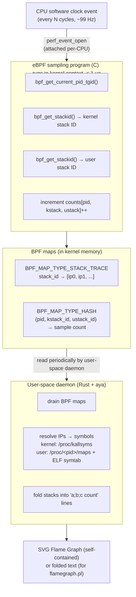
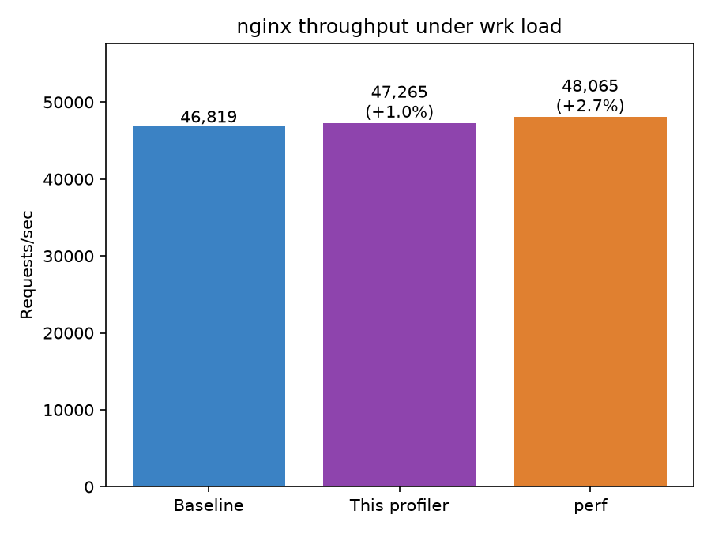
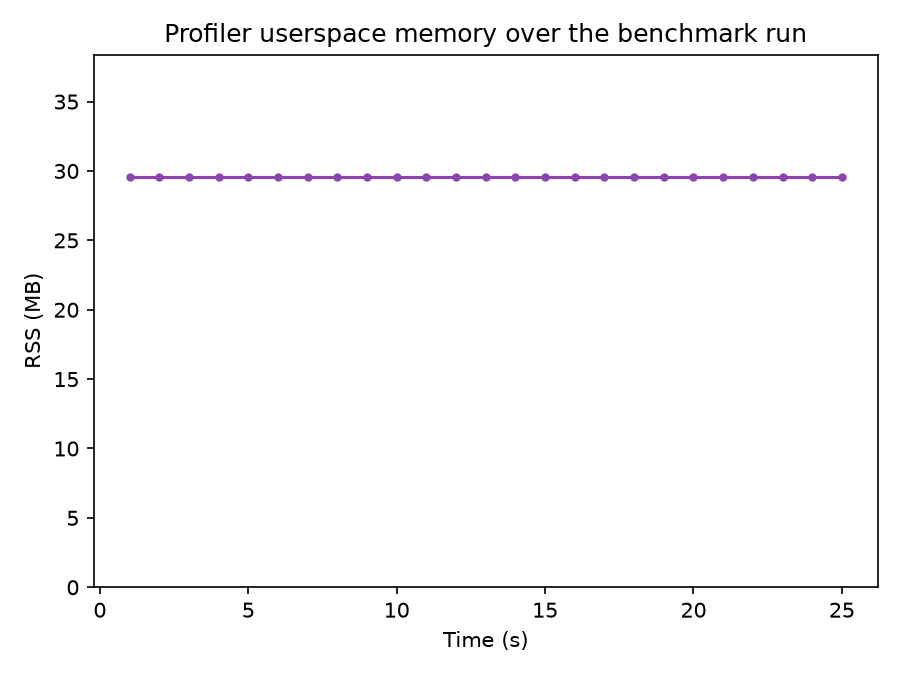
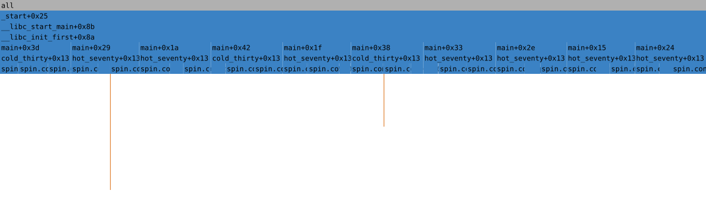
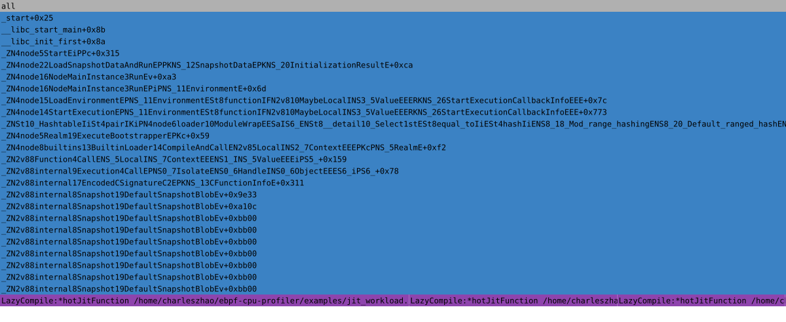
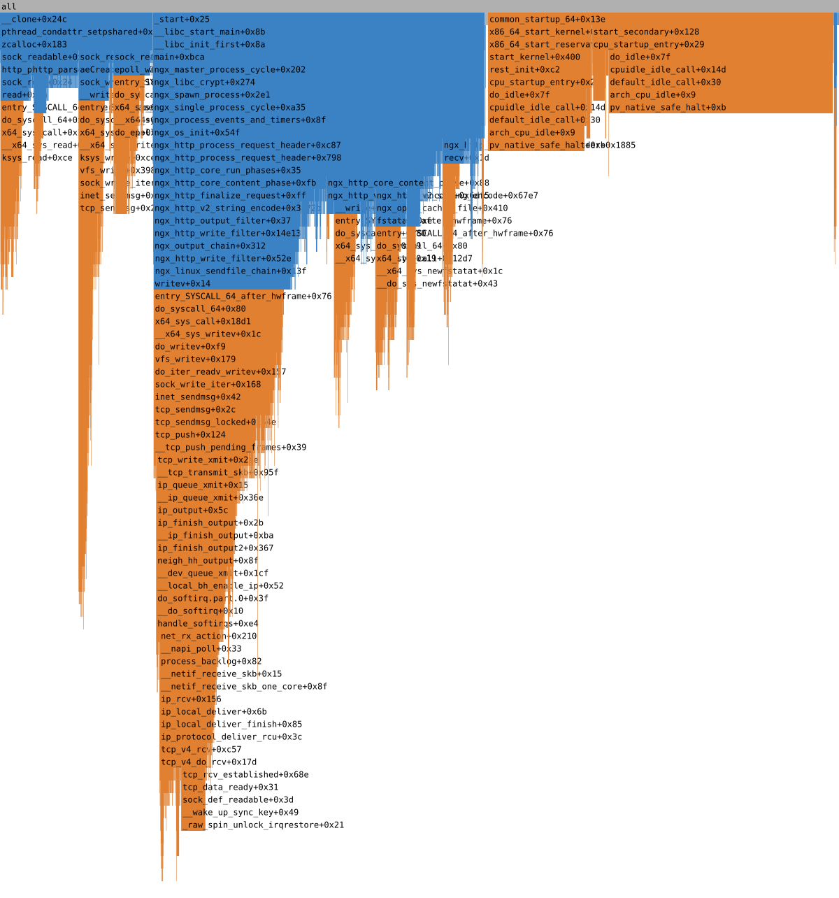

# eBPF CPU Flame Graph Profiler

%20%2B%20Rust-blue)


[](https://github.com/czhao-dev/ebpf-cpu-profiler/actions/workflows/test.yml)

A low-overhead, system-wide CPU profiler that uses eBPF to sample on-CPU call stacks across all processes at a configurable frequency, resolves instruction pointers to human-readable symbols, and renders an interactive SVG flame graph — with no instrumentation of target programs, no kernel module, and no dependency on `perf` or BCC.

Architecturally: a **C** eBPF program attached to `perf_event_open` software CPU-clock events captures kernel and user-space stacks on every CPU at each sample. A **Rust** user-space daemon (built on [`aya`](https://aya-rs.dev/)) reads the BPF maps, resolves symbols from `/proc/kallsyms`, ELF symbol tables, and JIT engines' `/tmp/perf-<pid>.map` files, and emits folded stacks that are either piped into Brendan Gregg's `flamegraph.pl` or rendered natively to a self-contained, interactive SVG with no external dependencies.

> **Status: MVP.** What's implemented today: on-CPU sampling, frame-pointer stack unwinding, kernel + user + JIT symbol resolution, folded-stack output, and the native SVG renderer. **Not yet implemented:** DWARF-based unwinding, off-CPU (scheduler blocking) profiling, differential flame graphs, and speedscope JSON output.

## Table of Contents

- [Repository Layout](#repository-layout)
- [How It Works](#how-it-works)
  - [eBPF Sampling Program](#ebpf-sampling-program)
  - [BPF Map Design](#bpf-map-design)
  - [Symbol Resolution](#symbol-resolution)
  - [Flame Graph Rendering](#flame-graph-rendering)
- [Building](#building)
- [Usage](#usage)
- [Testing](#testing)
- [Edge Cases](#edge-cases)
- [Benchmarking](#benchmarking)
- [Design Decisions](#design-decisions)
- [References](#references)

## Repository Layout

```text
.
├── Cargo.toml                    # workspace: profiler-common, profiler
├── profiler-common/              # shared struct(s) generated from profiler.h via bindgen
├── profiler-bpf/                 # C sources for the eBPF program (not a cargo crate)
│   ├── include/profiler.h        # struct sample_key - single source of truth, C + Rust
│   ├── bpf_helpers.h             # vendored minimal SEC()/map-def/helper declarations
│   └── profiler.bpf.c            # the eBPF sampling program
├── tools/gen-vmlinux.sh          # regenerate vmlinux.h from a running kernel's BTF (not yet needed, see above)
├── tools/diff_vs_perf.sh         # differential test: this profiler vs. `perf` on the same workload
├── tools/foldedcmp.py            # top-function overlap comparison used by diff_vs_perf.sh
├── tools/bench_overhead.sh       # nginx+wrk overhead benchmark (baseline/profiler/perf)
├── tools/bench_nginx.conf        # minimal, self-contained nginx config for the benchmark
├── tools/plot_benchmark.py       # matplotlib charts from bench_overhead.sh's CSV output
├── profiler/                     # the userspace Rust daemon
│   ├── build.rs                  # invokes `clang -target bpf` to compile profiler.bpf.c
│   ├── src/
│   │   ├── main.rs / lib.rs      # composition root (Linux-only `run()`; other OSes print an error)
│   │   ├── cli.rs                # clap CLI (`record` subcommand)
│   │   ├── perf.rs               # perf_event_open attach across all online CPUs (Linux/aya)
│   │   ├── maps.rs               # BPF map draining + frame-chain reconstruction (Linux/aya)
│   │   ├── kallsyms.rs           # /proc/kallsyms parser + resolver
│   │   ├── usersym.rs            # /proc/<pid>/maps + ELF symbol table resolver, with caching
│   │   ├── jitsym.rs             # /tmp/perf-<pid>.map parser (JIT engine symbols)
│   │   ├── symbolize.rs          # kernel/user/JIT resolver facade + Frame/FrameKind types
│   │   ├── folded.rs             # folded-stack aggregation and text emission
│   │   └── svg.rs                # native SVG flame graph renderer
│   └── tests/
│       ├── fixtures/             # small prebuilt Linux ELF used by usersym.rs tests
│       ├── integration.rs        # Linux-only, #[ignore]'d end-to-end test (frame pointers present)
│       ├── accuracy.rs           # #[ignore]'d: sampled ratio vs. examples/burn.c's known 70/30 split
│       ├── edge_cases.rs         # #[ignore]'d: truncated stacks when frame pointers are omitted
│       └── jit.rs                # #[ignore]'d: JIT symbolication against a real Node.js workload
├── examples/cpu_bound.c          # recursive Fibonacci workload for the integration test
├── examples/burn.c               # deterministic 70/30 CPU-split workload for the accuracy test
├── examples/jit_workload.js      # Node.js busy loop for the JIT symbolication test
├── docs/images/                  # real flame graphs and benchmark charts (see Benchmarking)
├── .github/workflows/test.yml    # CI: unit tests + privileged integration/benchmark suite
└── README.md
```

`perf.rs` and `maps.rs` (and the `linux` composition path in `lib.rs`) are gated with `#[cfg(target_os = "linux")]` and depend on `aya`, which itself only builds on Linux. Every other module (`cli`, `kallsyms`, `usersym`, `jitsym`, `symbolize`, `folded`, `svg`) is plain, cross-platform Rust and fully unit-tested without a Linux host.

## How It Works



### eBPF Sampling Program

The BPF program ([`profiler-bpf/profiler.bpf.c`](profiler-bpf/profiler.bpf.c)) is a `BPF_PROG_TYPE_PERF_EVENT` program attached via `perf_event_open(2)`:

```c
struct perf_event_attr attr = {
    .type        = PERF_TYPE_SOFTWARE,
    .config      = PERF_COUNT_SW_CPU_CLOCK,
    .freq        = 1,          // use .sample_freq, not .sample_period
    .sample_freq = 99,         // 99 Hz — avoids lock-step with 100 Hz kernel timer
};
```

99 Hz rather than 100 Hz is deliberate: a 100 Hz profiler sampling in lock-step with the kernel's 100 Hz jiffy timer systematically over- or under-samples code that runs in sync with timer interrupts. A prime-ish frequency breaks that synchronization.

One `perf_event_open` file descriptor is opened per online CPU (via `aya`'s `PerfEvent::attach`, one call per entry from `aya::util::online_cpus()`) and the same BPF program is attached to each. The BPF program runs with interrupts disabled in a non-preemptible context; it must complete quickly and may not sleep or allocate memory.

The program only calls stable, primitive-typed BPF helpers (`bpf_get_current_pid_tgid`, `bpf_get_stackid`, and hash/array map helpers) — it never reads kernel struct fields, so it does not currently need CO-RE (`vmlinux.h` / `BPF_CORE_READ`). That becomes necessary once code that inspects kernel structs is added — for example, an off-CPU profiler reading `task_struct` fields off the `sched:sched_switch` tracepoint. [`tools/gen-vmlinux.sh`](tools/gen-vmlinux.sh) is already in place for that future work.

### BPF Map Design

Four maps, all defined declaratively in `profiler.bpf.c` using the libbpf/BTF `SEC(".maps")` convention:

**`stack_traces` (`BPF_MAP_TYPE_STACK_TRACE`).**
The kernel's built-in stack-trace map: `bpf_get_stackid(ctx, &stack_traces, flags)` walks the call stack (via frame pointers), stores the array of instruction pointers as a value, and returns an integer stack ID as the key. Two separate calls — one with `BPF_F_USER_STACK` for the user-space stack, one without for the kernel stack — give independent IDs into the same map.

**`counts` (`BPF_MAP_TYPE_HASH`).**
Maps `struct sample_key { u32 pid; u32 tgid; s32 kern_stack_id; s32 user_stack_id; }` (defined once in [`profiler-bpf/include/profiler.h`](profiler-bpf/include/profiler.h) and shared with the Rust side via `bindgen`) to a `u64` sample count. The user-space daemon drains this map once per output interval and removes each drained key so the next interval only reflects new samples.

**`targets` (`BPF_MAP_TYPE_HASH`) + `config` (`BPF_MAP_TYPE_ARRAY`).**
`targets` maps `tgid → 1` for targeted profiling (`-p/--pid`). Unlike a naive "empty map = profile everything" design, a bare `bpf_map_lookup_elem` miss on an empty hash map is indistinguishable from "this tgid isn't targeted" — so a single-entry `config` array holds a `filter_enabled` flag, written once by userspace at startup only when `-p/--pid` is passed. The BPF program only consults `targets` when `filter_enabled` is set.

### Symbol Resolution

Symbol resolution maps raw instruction pointers back to `function_name(+offset)` strings, entirely in user space ([`profiler/src/kallsyms.rs`](profiler/src/kallsyms.rs), [`profiler/src/usersym.rs`](profiler/src/usersym.rs)); the BPF program only captures raw `u64` addresses.

**Kernel symbols.** `/proc/kallsyms` lists every kernel and module symbol with its virtual address. The daemon reads this file once at startup into a sorted array and binary-searches it per IP, attributing addresses between two consecutive entries to the lower symbol at `symbol+offset`. If every address reads as zero (`kptr_restrict` hiding them from an unprivileged read), kernel frames degrade to `[unknown]` with a single startup warning rather than failing outright.

**User-space symbols.** For each unique PID seen in a drain cycle the daemon reads `/proc/<pid>/maps` to find which ELF file and load offset back each virtual address, then parses the file's `.symtab` (falling back to `.dynsym` if stripped) via the [`object`](https://docs.rs/object) crate and binary-searches the sorted symbol table. Parsed tables are cached by `(dev, inode)` so a library shared across hundreds of processes is only parsed once.

**JIT-compiled symbols.** Code emitted by a JIT engine (V8/Node, the JVM) lives in an anonymous `mmap` region with no backing file, so the ELF path above never resolves it. [`profiler/src/jitsym.rs`](profiler/src/jitsym.rs) parses `/tmp/perf-<pid>.map` — the address-range-to-symbol map JIT engines write when run with basic profiling enabled (Node's `--perf-basic-prof`, perf-map-agent for the JVM) — and `usersym.rs`'s `UserSymbolCache::resolve` falls back to it whenever the ELF lookup comes up empty. Resolved frames are tagged `Frame::Jit` and rendered in a distinct color (see below) so they're visually distinguishable from ahead-of-time-compiled user frames. See [Edge Cases](#edge-cases) for a real example.

Frame-pointer unwinding is the only stack-walking strategy implemented so far: `bpf_get_stackid` walks the `rbp` chain in-kernel for both user and kernel stacks. This requires the target binary to be compiled with `-fno-omit-frame-pointer` (the Linux kernel itself, Go 1.12+, and any C/C++ binary built with the flag all qualify); binaries built with the default `-fomit-frame-pointer` will produce truncated stacks rather than an error. See [Edge Cases](#edge-cases).

### Flame Graph Rendering

The daemon produces **folded stacks** — one line per unique call path seen during the interval:

```
main;work;compute;fft_radix2 412
main;work;io_wait;epoll_wait 87
```

Each line is a semicolon-separated call chain (outermost frame first, user frames then kernel frames) followed by the sample count — the canonical input for Brendan Gregg's `flamegraph.pl`. The daemon also includes a native SVG renderer ([`profiler/src/svg.rs`](profiler/src/svg.rs)) so there is no Perl dependency: an icicle layout, color-coded by frame kind (kernel = orange, user = blue, JIT = purple, unknown = grey), with embedded click-to-zoom and `/`-triggered regex search — no external JS libraries. See real, profiler-generated examples in [Benchmarking](#benchmarking).

## Building

Dependencies: Rust (stable) and a `clang` build with the `bpf` target registered. Apple's system clang on macOS does **not** include the `bpf` target — [Homebrew's LLVM](https://formulae.brew.sh/formula/llvm) does.

```sh
# Linux
apt-get install clang llvm

# macOS (for BPF compilation only; the profiler itself only runs on Linux)
brew install llvm
```

```sh
cargo build --release -p profiler
# on macOS, point build.rs at a BPF-capable clang:
CLANG=$(brew --prefix llvm)/bin/clang cargo build --release -p profiler
```

`profiler/build.rs` shells out to `clang -target bpf` to compile `profiler-bpf/profiler.bpf.c` into a BPF object, which is embedded into the daemon binary at build time via `aya::include_bytes_aligned!`. There is no separate Makefile step — `cargo build` is the only command needed.

## Usage

Profile all processes system-wide for 30 seconds at 99 Hz, writing an SVG:

```sh
sudo ./target/release/flamegraph-profiler record -d 30 -o profile.svg
```

Profile a single process by PID, emitting folded-stack text instead:

```sh
sudo ./target/release/flamegraph-profiler record -p $(pgrep postgres) -d 10 --format folded -o postgres.folded
```

```
$ flamegraph-profiler record --help
Sample on-CPU stacks system-wide (or for specific PIDs) and emit a flame graph

Usage: flamegraph-profiler record [OPTIONS]

Options:
  -p, --pid <PID>                    Restrict profiling to these PIDs (repeatable). Default: all processes.
  -d, --duration <DURATION>          How long to sample, in seconds [default: 30]
  -F, --frequency <FREQUENCY>        Sampling frequency in Hz [default: 99]
      --drain-interval-ms <MS>       How often to drain BPF maps, in milliseconds [default: 1000]
  -o, --output <OUTPUT>              Output file path
      --format <FORMAT>              [default: svg] [possible values: folded, svg]
```

## Testing

All of the below runs automatically on every push/PR via [`.github/workflows/test.yml`](.github/workflows/test.yml): an unprivileged job for the unit tests and clippy, and a privileged job (root, real eBPF) for everything requiring Linux — see the CI badge at the top of this README.

```sh
cargo test --workspace     # pure-logic unit tests: kallsyms, usersym, jitsym, folded, svg, cli - run anywhere
cargo clippy --workspace --all-targets -- -D warnings
```

These pass on any OS, including macOS, since `perf.rs`/`maps.rs` (the only modules that touch `aya`/real BPF maps) are compiled out on non-Linux targets. Coverage: kallsyms binary search (exact match, offset, before-first-symbol, all-zero/`kptr_restrict` degradation, duplicate addresses), `/proc/<pid>/maps` parsing (including paths containing spaces) and ELF `.symtab` symbol resolution with a checked-in fixture binary (`profiler/tests/fixtures/fixture.o`) plus a cache-hit-count assertion, folded-stack aggregation and sorting, and SVG well-formedness (via `roxmltree`) with special-character escaping.

The end-to-end integration test requires a real Linux kernel with eBPF/`perf_event_open` support and root:

```sh
cargo build --release -p profiler
sudo cargo test -p profiler --test integration -- --ignored --nocapture
```

It compiles [`examples/cpu_bound.c`](examples/cpu_bound.c) (a recursive Fibonacci workload) with `-fno-omit-frame-pointer`, profiles it for 5 seconds, and asserts `fib` appears in the folded output.

This has been verified end-to-end on real Linux (a privileged container on kernel 6.10, `--pid=host` so BPF-visible PIDs match the ones passed to `-p`): the BPF object loads and attaches on every CPU, `-p <pid>` filtering correctly restricts sampling, frame-pointer unwinding recovers the true recursive call chain, and both output formats work, e.g. a real folded-stack line captured from `examples/cpu_bound.c`:

```
_start+0x30;__libc_start_main+0x98;__libc_init_first+0x84;main+0x24;fib+0x208;fib+0x2f4 26
```

and the SVG output is well-formed XML containing the same resolved `fib+0x...` frames. The `--ignored` integration test above passes in that environment.

### Accuracy test: a known-ratio workload

[`examples/burn.c`](examples/burn.c) burns CPU in two identically-costed functions, `hot_seventy()` and `cold_thirty()`, called in a fixed 7:3 ratio per round — a ground truth to check the profiler's *sampled* ratio against. [`profiler/tests/accuracy.rs`](profiler/tests/accuracy.rs) profiles it and asserts the sampled split lands within 62-78% (loose on purpose — sampling is statistical) and that the full `main → {hot_seventy,cold_thirty} → spin` call chain is recovered, not just the leaf function name:

```sh
sudo cargo test -p profiler --test accuracy -- --ignored --nocapture
```

Building this workload surfaced two real gcc optimizations worth knowing about if you write similar test workloads: at `-O2`, gcc turns a function whose entire body is one tail call into a jump (`-fno-optimize-sibling-calls` disables that), and it merges functions with byte-identical bodies into one symbol (identical-code-folding) unless their code actually differs — see the comment at the top of `burn.c` for how this is worked around.

### Differential test against `perf`

[`tools/diff_vs_perf.sh`](tools/diff_vs_perf.sh) runs this profiler and `perf record`/`perf script` against the same workload/PID/window, collapses perf's output inline (an ~20-line awk script — no vendored `stackcollapse-perf.pl`), and compares the top-5 hottest functions from each via [`tools/foldedcmp.py`](tools/foldedcmp.py)'s Jaccard overlap:

```sh
cc -O2 -fno-omit-frame-pointer -fno-optimize-sibling-calls -o burn examples/burn.c
sudo tools/diff_vs_perf.sh ./burn 6
```

Run for real on the GCP validation VM (see [Benchmarking](#benchmarking)), this profiler and `perf` agreed on 4 of 5 top functions (67% overlap, above the 60% pass threshold) — the expected level of agreement given frame-pointer-only unwinding and perf's own unwinder can legitimately disagree on non-leaf frames while still agreeing on what's actually hot.

## Edge Cases

**Frame pointers omitted.** [`profiler/tests/edge_cases.rs`](profiler/tests/edge_cases.rs) compiles `examples/cpu_bound.c` with `-fomit-frame-pointer` (rather than `integration.rs`'s `-fno-omit-frame-pointer`) and asserts the recursive `fib` call chain is truncated to at most one frame per stack, instead of the full recursion recovered when frame pointers are present. This is the documented, expected behavior of `bpf_get_stackid`'s in-kernel `rbp`-chain walk (see [Design Decisions](#design-decisions)) — not a bug, and not something an eBPF program can work around without a materially different (and much more expensive) unwinding strategy.

```sh
sudo cargo test -p profiler --test edge_cases -- --ignored --nocapture
```

**JIT-compiled code (Node.js).** [`profiler/tests/jit.rs`](profiler/tests/jit.rs) runs [`examples/jit_workload.js`](examples/jit_workload.js) under `node --perf-basic-prof`, profiles it, and asserts the JIT-compiled function's name — not `[unknown]`, not a raw hex address — appears in the output, resolved via the `/tmp/perf-<pid>.map` support described in [Symbol Resolution](#symbol-resolution). Skips gracefully if `node` isn't on `PATH` rather than failing, since Node.js isn't a hard dependency of this project.

```sh
sudo cargo test -p profiler --test jit -- --ignored --nocapture
```

[`docs/images/jit_flamegraph.svg`](docs/images/jit_flamegraph.svg) is a real flame graph from this test, generated on the GCP validation VM — the purple frames are `hotJitFunction`, resolved entirely from the perf map file since it has no ELF symbol table entry.

## Benchmarking

[`tools/bench_overhead.sh`](tools/bench_overhead.sh) drives nginx with `wrk` under three conditions — baseline, this profiler active system-wide, `perf` active system-wide — and measures request throughput, the profiler's own RSS, and whether it logged a BPF map near-capacity (dropped sample) warning:

```sh
sudo tools/bench_overhead.sh 20 99          # 20s per phase, 99 Hz
python3 tools/plot_benchmark.py             # renders the charts below from the CSV it wrote
```

Real results from a run on a GCP `n2-standard-2` (2 vCPU, Ubuntu 24.04) validation VM, 20s per phase at 99 Hz:

| Condition | RPS | vs. baseline | Profiler RSS peak | Samples dropped |
|---|---|---|---|---|
| Baseline | 46,819 | – | – | – |
| This profiler | 47,265 | +1.0% | ~29.5 MB | no |
| `perf` | 48,065 | +2.7% | – | – |



The profiler's RPS impact is within run-to-run measurement noise on this shared 2-vCPU host (it measured *faster* than baseline here, which says more about benchmark variance than genuine speedup) — consistent with the design goal of near-zero overhead, though not a substitute for a dedicated, isolated-hardware benchmark if you need tighter numbers. Userspace RSS held flat at ~29.5MB for the full run with no growth, and no BPF map capacity warnings were logged:



### Real flame graphs

All three below were generated by `flamegraph-profiler record --format svg` on the GCP validation VM — not synthetic or hand-edited. Click-to-zoom and `/`-search (see [Flame Graph Rendering](#flame-graph-rendering)) work when the SVG is opened directly ([raw file view](docs/images/)), not in GitHub's sanitized inline preview below.

**`examples/burn.c`** — the roughly-even widths of each `hot_seventy`/`cold_thirty` call visually reproduce the 70/30 split (blue = user frames):



**Node.js JIT workload** — purple frames are `hotJitFunction`, resolved via `/tmp/perf-<pid>.map` since it has no ELF symbol table entry:



**System-wide capture during the nginx+wrk benchmark** — both kernel (orange) and user (blue) frames:



## Design Decisions

**C for the kernel program, Rust for the daemon.** eBPF C with `clang -target bpf` remains the most mature toolchain for the kernel-side program (verifier-friendly, no borrow-checker friction for hand-tuned map access patterns). The user-space daemon has no such constraint, so it's written in Rust for memory safety and a modern package ecosystem, loaded via [`aya`](https://aya-rs.dev/) — a pure-Rust eBPF library with no `libbpf`/`libelf` C dependency. `aya` loads the plain clang-compiled BPF object directly: it resolves CO-RE relocations and detects program types from the same `SEC()` section-naming convention libbpf uses, so the C side needs no Rust-specific tooling.

**Aggregate in the kernel, not user space.** Streaming every raw sample to user space via a ring buffer and aggregating there would transmit O(samples × stack_depth × 8) bytes per second — at 99 Hz × 8 CPUs × 127 frames × 8 bytes, several MB/s. Aggregating counts in a `BPF_MAP_TYPE_HASH` in the kernel transmits only unique stacks per drain cycle. The trade-off is a fixed `max_entries` limit; the daemon logs a warning when the unique-stack count approaches it.

**99 Hz over higher frequencies.** Higher sampling frequencies reduce statistical noise but increase overhead super-linearly. Brendan Gregg's original CPU profiling work established 99 Hz as the practical sweet spot for continuous profiling.

**Frame-pointer unwinding only, for now.** DWARF-based unwinding is correct on more binaries but requires reading target process memory per frame — substantially more expensive, and a materially bigger implementation (a CFI interpreter). Frame-pointer mode covers the Linux kernel itself, modern Go binaries, and any C/C++ binary built with `-fno-omit-frame-pointer`, and was chosen as the MVP's only unwinding strategy to keep the initial implementation's scope tractable.

**Native SVG over a `flamegraph.pl` dependency.** Requiring Perl to render output adds a dependency absent on many production hosts and containers. The folded-stack text output remains available for anyone who prefers the Perl tool.

## References

- Brendan Gregg. [Flame Graphs](https://www.brendangregg.com/flamegraphs.html). — the original flame graph methodology, folded-stack format, and `flamegraph.pl`.
- Brendan Gregg. [Systems Performance: Enterprise and the Cloud](https://www.brendangregg.com/systems-performance-2nd-edition-book.html). Addison-Wesley, 2020. — eBPF profiling, off-CPU analysis, and USE methodology.
- Brendan Gregg. [BPF Performance Tools](https://www.brendangregg.com/bpf-performance-tools-book.html). Addison-Wesley, 2019. — comprehensive reference for BPF-based observability tools.
- Andrii Nakryiko. [BPF CO-RE (Compile Once, Run Everywhere)](https://nakryiko.com/posts/bpf-core-reference-guide/). — BTF-based portability, `BPF_CORE_READ`, and `vmlinux.h`.
- Andrii Nakryiko. [libbpf-bootstrap](https://github.com/libbpf/libbpf-bootstrap). — the C-side map-definition and `SEC()` conventions this project follows.
- The `aya` project. [aya-rs.dev](https://aya-rs.dev/). — the Rust eBPF library used for the user-space daemon.
- Linux kernel. [`kernel/bpf/stackmap.c`](https://github.com/torvalds/linux/blob/master/kernel/bpf/stackmap.c). — `BPF_MAP_TYPE_STACK_TRACE` implementation and `bpf_get_stackid` helper.

## License

MIT License. See [LICENSE](LICENSE) for details.
